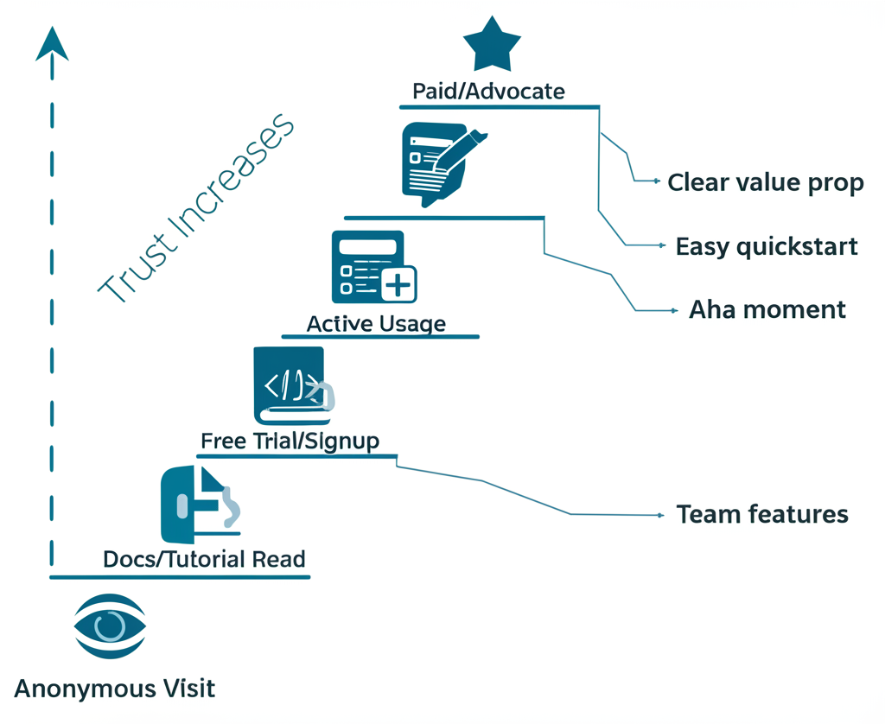
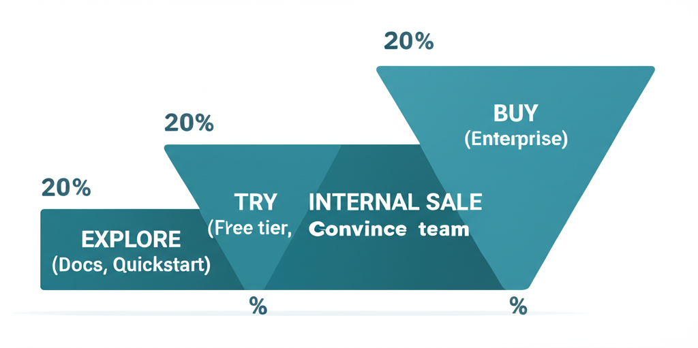

# Website & Landing Pages for Developer Tools

A comprehensive guide to creating developer-focused websites that convert. From foundational principles to advanced design patterns.

---

## Level 1: Foundations

### The Core Truth About Developer Websites

Developers want to understand what your tool does, when it's good for them, and when it isn't. They know there's no silver bullet and there are tradeoffs. **Saying where your tool is NOT a great fit gives comfort and safety to devs.**

> "Show me options and let me choose" — The developer mindset

### The One Metric That Matters

If you could choose one metric for your entire dev marketing efforts: **Time to First Hello World**.

Measure it from signup or from landing on the website. It's a proxy for how smooth the try-out experience is and a great candidate for your activation metric.

### What Makes Developer Websites Different

Modern dev-focused companies are moving away from corporate aesthetics toward:
- Cosmos and 3D graphics
- Gaming-inspired designs
- Dark mode / IDE-like aesthetics
- Code-first visual elements

Examples: Vercel Workflows, DagsHub, modern Supabase

---

## Level 2: Header & Value Proposition

### The Anatomy of a Great Dev Tool Header

A strong header needs these components:

1. **The "What"** — Explained immediately (e.g., "Video API", "live and on-demand experiences")
2. **Clear Persona** — Who is this for ("for developers")
3. **Job to Be Done** — What they'll accomplish ("build online video")

**Example from Mux:**
- Clear "what": Video API
- Super clear persona: developers
- Job to be done: build online video experiences
- Animated visual showing API → UI results

### Value Proposition Frameworks

**The Jargon Balance:** Common wisdom says talk about values, not features. But for developers, using industry jargon often works great.

**Solution: Show Both + The "How"** (Tailwind CSS approach):
1. Show the result
2. Name the feature (use jargon)
3. Show the code with highlighted relevant parts

This educates and inspires simultaneously.

### Header Design Patterns

**Pattern: Header with Tabs** (Appsmith)
When your tool does many things, use tabs in the header to let users self-select their use case without overwhelming.

**Pattern: Competitor Mention** (Axiom)
In mature categories, explicitly own your unique selling point versus known competitors:
- Don't pretend you're the only one
- Show how you're different (speed, features, price)
- Use competitor names directly

**Pattern: Event Promotion in Header** (Vercel)
For major events, place registration CTAs right in the header — it's the most viewed part of the most visited page.

### Naming and Category Framing

Words carry expectations, fears, and hopes. The difference between calling yourself a "language" vs "framework" vs "platform" is massive.

**Wasp Case Study:**
- "Language for web devs" → Scary, feels like huge workflow change
- "Framework for web devs" → Numbers shot up immediately

Think carefully about: language, framework, platform, tool, suite, solution, app, extension

---

## Level 3: Feature Sections & Visual Design

### The Compact Scrolling Feature Section

**Problem:** Displaying multiple features without making pages exhaustingly long.

**Solution (from Graphite):**
- Single section switches subsections as users scroll
- Progress bar indicates advancement
- Each subsection: headline + one-liner + CTA + visual
- Can show 5+ features without overwhelming

**Variants:**
- Remove the one-liner or "Learn more" button
- Auto-progress sections if users don't interact

### Interactive Diagram Sections (Buildkite)

For complex products:
- Show a single diagram representing your platform
- As user scrolls, Headline-Subhead-CTA changes
- Different parts of the diagram highlight
- Solves the "diagram + text" balance problem

### Showing Code and UI Together

The dance of showing code without overwhelming:
- Show code to make it feel "devy"
- But don't show everything
- UI should look like your actual UI
- Show only what's necessary

**CircleCI approach:** Clean video explainers that balance code visibility with clarity.

### Social Proof That Works

**Beyond logos — Buildkite's approach:**
- Mini case studies with logos
- Show: Product metrics (CI/CD jobs), Known app result (Slack, Uber), ROI numbers (60% faster)
- Conveys massive info in small space

---

## Level 4: CTAs & Conversion

### CTA Philosophy for Developers

Most CTAs should go to docs. Use actionable copy:
- "Start building"
- "Extend [Product]"
- "Launch playground" (for sandbox experiences)

### The "Playground" CTA Pattern

For infrastructure tools where showing value quickly is hard:

**Good copy elements:**
- Acknowledge it isn't a real thing ("playground")
- Convey interactivity
- Make it feel like less work, more play

Example: "Play with Axiom" → "Launch Playground"

### GitHub Star CTA Placement

Put your GitHub star counter/CTA in the navbar. It's always visible and capitalizes on social proof.

### Docs-to-Conversion Trick

**Add a signup CTA to your docs header.**

Stripe added "Create Account" to their docs header and saw significant conversion impact. Apollo GraphQL saw 20% signup increase with this simple change.

---

## Level 5: Developer Funnel Structure

### The Developer Marketing Funnel

Unlike classic B2B (awareness → consideration → conversion), dev tools have:

**1. Exploration**
- Communicate clear differentiation
- Make navigation easy (interactive navbars, show more on hover)
- Show your tool works with their stack (logos, SDK snippets, testimonials)
- Make quickstarts and API docs easy to find

**2. Demo**
- Show working samples (sandbox, template, live app)
- Provide searchable template library by use case/language/framework
- Step-by-step guides for implementation
- Architectural scenarios showing ecosystem integration

**3. Internal Sale**
- Use cases and solution pages for less technical visitors
- Enterprise features prominently on pricing/enterprise pages
- "Convince your boss" content pack: value prop, features, case studies, ROI calculators, email templates

---

## Level 6: Navigation & Information Architecture

### Navbar Best Practices

**Self-hosted deployment placement (n8n):**
Place self-hosted deployment guidance in docs tab dropdown. This frontloads a key differentiator where developers naturally look.

**What else to surface in docs dropdown:**
- Quickstart guides
- Integration documentation
- Self-hosted options

### The "Escape Hatch" Principle

People will land on wrong pages. Example: Googling "Stripe checkout" can land you on dev-focused or no-code-focused page.

**Solution:** Put a link/button at the top to help people go to the page they actually wanted.

---

## Level 7: Specific Page Types

### Comparison Pages

Developers search competitively more than typical buyers. Clear comparisons capture high-intent traffic.

**New Relic vs Datadog approach:**
- Price comparison graphs
- CTAs focused on helping compare prices
- Category-specific jargon to drive the argument

### Pricing Pages

**Elena Verna's Framework:**
- No placeholder header copy ("Pricing that works...")
- Logos above main table for social proof
- 3 plans: individual/team/organization
- Clear "for whom" each plan is designed
- "Everything in +" pattern
- CTA moved up

**Retool's Clarity:**
Instead of ambiguous deployment terminology:
- "Cloud (we host)"
- "Self-hosted (you host)"

---

## Level 8: The Complete Picture

### Who Should You Address on the Homepage?

**Land messaging for the champion, not the broadest audience.**

Developers naturally think and talk about products through anchoring. Use it in your messaging.

**Anchoring examples:**
- "Open-source Firebase alternative" (Supabase)
- Reference to known tools: "If X and Y had a baby that focused on Z"
- Tinybird: One sentence referencing ClickHouse, Supabase, and Postgres carries massive meaning to the right audience

### The Clear Copy Test

Two versions tested:
1. "The easiest way to capture and transcribe meetings"
2. "The API for developers to access meeting recordings, transcripts and metadata"

**Version 2 won.** It clearly says what it does. The first sounds like an investor pitch. The second captures interest of people searching for solutions.

### Positioning Advice

**Don't be "for every company on the planet."**

Early on: Start narrow, build credibility, build one fantastic product people rave about. Then go wider.

**Example:** Snyk's narrow initial positioning — they didn't try to be everything from day one.

---

## Quick Reference Checklist

### Header
- [ ] Clear "what" in first 5 words
- [ ] Obvious persona identification
- [ ] Job to be done stated
- [ ] Primary CTA goes to docs/signup
- [ ] Secondary CTA for demo/sandbox
- [ ] GitHub stars visible

### Value Proposition
- [ ] Shows feature + value + how
- [ ] Uses appropriate jargon
- [ ] Mentions where NOT a fit
- [ ] Competitor positioning if mature market

### Navigation
- [ ] Self-hosted/quickstart in docs dropdown
- [ ] Escape hatches for wrong landings
- [ ] Search functionality prominent

### Social Proof
- [ ] Logos visible
- [ ] Mini case studies with metrics
- [ ] Testimonials from known companies

### Feature Sections
- [ ] Not overwhelming
- [ ] Progressive disclosure via scroll
- [ ] Code + result shown together
- [ ] Interactive elements where appropriate

### Conversion Elements
- [ ] Signup CTA in docs header
- [ ] Playground/sandbox accessible
- [ ] Clear path from explore → try → buy

---

## Resources & Further Reading

**Comprehensive Guides:**
- [The Ultimate Guide to Building Developer Tool Websites](http://www.plg.news/p/the-ultimate-guide-to-building-developer-website) — Ben Williams
- [Dev Tool Website Design Principles](https://playbooks.hypergrowthpartners.com/p/devtools-website-design-principles) — Gonto (ex-Auth0)
- [Who to Address on the Dev Tool Homepage](https://www.developermarkepear.com/blog/who-to-address-on-the-dev-tool-homepage)

**Value Proposition & Positioning:**
- [Value Proposition for Developer Tools (20+ examples)](https://www.developermarkepear.com/blog/value-proposition-developer-tools-examples)
- [How Stripe's GTM Evolved Over Time](https://lethain.com/stripe-product-led-developer-centric-growth)
- [Developer Segmentation Framework](https://www.heavybit.com/library/blog/heres-how-to-do-segmentation-better)

**Examples:**
- [Tailwind CSS](https://tailwindcss.com/) — Feature + value + code pattern
- [Clerk](https://clerk.com/) — Interactive feature tiles
- [Mux](https://www.mux.com/) — Great API product header
- [Deepgram](https://deepgram.com/) — API visual in header

**Podcasts:**
- [The Developer-Facing Startup with Adam Frankl](https://open.spotify.com/episode/6mK5cdDqCIhZXY05BnOOVE) — Social proof, marketing problem vs product
