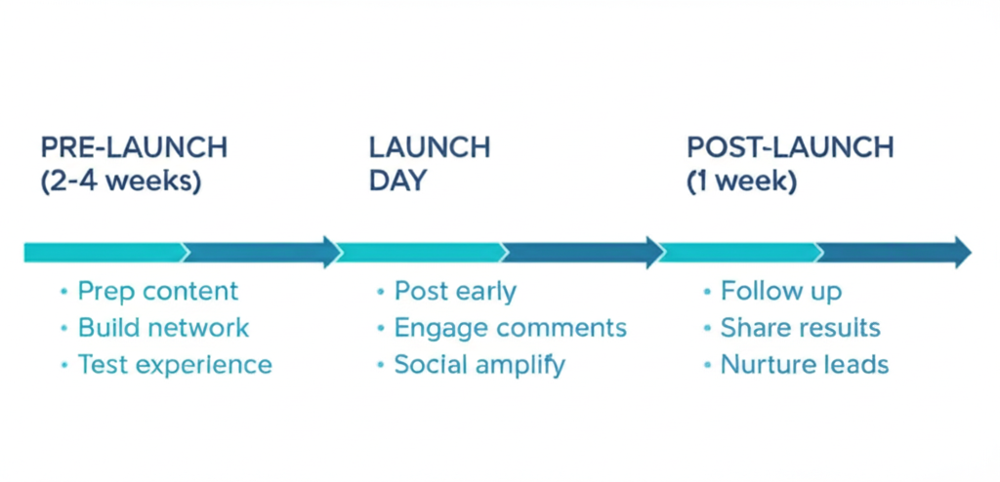
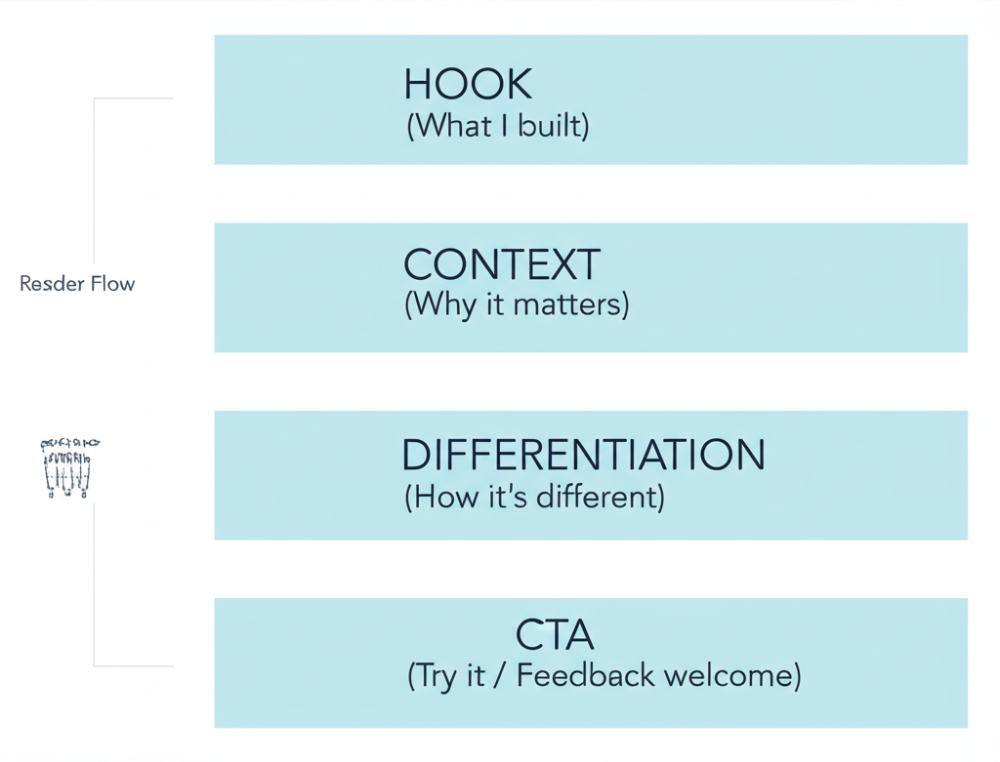

# Hacker News & Product Hunt Launch Guide

A comprehensive guide to launching developer tools on HN and Product Hunt. From understanding the platforms to executing successful launches.

---

## Part 1: Hacker News Fundamentals

### Understanding Hacker News

HN is not a marketing channel — it's a community of builders who share and discuss interesting things. Your content needs to genuinely interest this audience.

**What works:**
- Deep technical content
- Authentic problem-solving stories
- New information that satisfies curiosity
- "Hacker to hacker" communication

**What doesn't work:**
- Obvious promotional content
- Marketing-speak
- "10 secret ways to..."
- Corporate messaging

---

## Part 2: The HN Launch Formula




### The Tailscale Framework

Tailscale consistently hits the front page. Here's their pattern:

**1. Problem → Obvious Solution → Why Obvious Solution Fails → Product → How It Works**

This structure:
- Validates the reader's existing knowledge
- Shows you understand the problem deeply
- Positions your solution as a natural evolution

### Title Strategy

**The Power of Understatement:**

Tested variations:
- "Getting a paper accepted" → 219 upvotes
- "How to Get Your Paper Accepted" → 3 upvotes
- "Your Paper Is an Ad" → 2 upvotes

**Winner:** The understated, story-like title.

**Best practices:**
- No "10 secret ways to..."
- No "gain X by doing Z"
- Use to-the-point titles: "I sell onions online" or "Tailscale Funnel"
- Authentic storytelling over marketing language

### Content Structure

**1. Create something that doesn't feel promotional**
Your post should teach, share, or inform first.

**2. Explain benefits through problems**
Don't list features. Explain the pain you solve.

**3. Go deep with new information**
HN readers want substance. Don't hold back.

**4. Satisfy curiosity about "how it works"**
Not "how to gain X by using Y" but rather "How to build Y from scratch"

**5. Write dev-to-dev, conversational**
Use technical jargon. Don't dumb it down.

### Post Length

Some of the best launches are long.

**fly.io example:** Hundreds of words explaining the technical approach in detail.

**Rule:** Use 700 words if that's what it takes to explain your approach properly. Better too thorough than too thin.

---

## Part 3: Preparing for Launch

### GlassFlow Case Study

They reached #1 on Show HN and stayed there for 12+ hours. Key learnings:

**1. Follow the guidelines exactly**
Use the format that works, the right tone of voice.

**2. Spend the biggest chunk on the problem**
Explain the problem and why obvious solutions don't work.

**3. Prepare for success**
The last thing you want is hitting the front page with a bad experience waiting.

Before launch, audit:
- Signup flow
- Docs
- First hello world experience
- Support response time

**4. Explain how it works in detail**
What you tried, why it didn't work. "Hacker to hacker."

### The Preparation Timeline

GlassFlow took a week to rework their post based on feedback:

1. First draft (too high-level)
2. Feedback round
3. Rewrite to more technical, straightforward explanation
4. Final review
5. Launch

Don't rush this process.

---

## Part 4: Writing Your Show HN



### The Information Flow

**Lead with:**
- What the problem is
- Who has this problem
- Why current solutions fail

**Then:**
- What your solution does differently
- How it works (technical detail)
- What makes your approach novel

**End with:**
- Where to try it
- What feedback you want
- Invitation to discuss

### Tone Calibration

**Do:**
- Use "we" or "I" — be personal
- Admit limitations
- Ask genuine questions
- Show technical depth
- Be humble about your claims

**Don't:**
- Sound like a press release
- Use marketing superlatives
- Oversell
- Ignore tradeoffs
- Sound corporate

---

## Part 5: Reddit/HN Cross-Posting

### The Reddit-Then-HN Trick

Post first on relevant subreddits to:
- Validate messaging
- Gather initial feedback
- Refine your explanation
- Build some initial traction

Then bring a refined version to HN.

---

## Part 6: Product Hunt Launch

### The PH Playbook (Matteo Tittarelli)

This playbook has gotten 3 tools to #1 of the day/week.

### Pre-Launch (2-4 weeks before)

**1. Build your hunter network**
- Identify relevant hunters
- Reach out early
- Prepare materials for them

**2. Prepare assets**
- High-quality screenshots
- Product video (short, punchy)
- Compelling tagline
- Description that hooks

**3. Seed your launch**
- Tell your community
- Email your users
- Prep social posts

### Launch Day

**1. Timing**
- Launch at 12:01 AM PST (PH resets at midnight Pacific)
- Have team ready for early hours

**2. First hour is critical**
- Activate your network
- Respond to every comment
- Share on social immediately

**3. Throughout the day**
- Continuous engagement
- Cross-post updates
- Thank supporters

### Post-Launch

**1. Follow up**
- Thank everyone who supported
- Share results
- Announce what's next

**2. Convert interest**
- Special offers for PH audience
- Capture leads
- Nurture relationships

---

## Part 7: Launch Weeks

### The Supabase Model

**Why launch weeks work:**
- Push velocity with static deadline
- Rally team around promotion
- Condense promotion for concentrated mindshare
- Create anticipation and momentum

### Launch Week Structure

**Day by day:**
- Each day = one feature/announcement
- Build toward biggest reveal
- Maintain momentum through variety
- End with a bang

**Content for each day:**
- Technical blog post
- Social announcement
- Demo/video
- Community engagement

### Learnings from Resend

- Don't announce everything at once
- Create daily reveals
- Have backup content ready
- Engage community throughout

---

## Part 8: Advanced Strategies

### Prepare for Success, Not Just Launch

**The GlassFlow lesson:** They prepared their entire developer journey before launch because they knew the worst thing would be hitting #1 with a bad experience.

### Before any launch:
1. Audit your core developer journey
2. Test signup → first value
3. Ensure docs are solid
4. Have support ready
5. Prepare for traffic spike

### The "Launch Then Iterate" Trap

**Don't:**
- Launch before you can support the interest
- Ignore feedback in comments
- Disappear after launch

**Do:**
- Stick around to engage
- Take feedback seriously
- Ship improvements quickly
- Follow up publicly

### Engineering-as-Marketing for Future Launches

Create free tools that build reputation before your product launch:
- ElevenLabs' speech-to-text tools
- Auth0's JWT debuggers
- Algolia's Hacker News search

When you launch the paid product, you already have credibility.

---

## Part 9: Common Mistakes

### HN Mistakes

1. **Too promotional** — Reads like marketing
2. **Too shallow** — Doesn't satisfy technical curiosity
3. **Wrong audience** — Not every dev tool fits HN
4. **Bad timing** — Launching when other big news dominates
5. **Abandoning comments** — Founders should be in the thread

### Product Hunt Mistakes

1. **Launching without a network** — Need initial momentum
2. **Poor assets** — Bad screenshots, weak description
3. **Wrong hunter** — Hunter doesn't have relevant audience
4. **No follow-through** — Launch and disappear
5. **Ignoring feedback** — PH users expect engagement

---

## Quick Reference: Launch Checklist

### Pre-Launch (2 weeks before)
- [ ] Developer journey audited and working
- [ ] Docs complete and tested
- [ ] Support system ready
- [ ] Launch post drafted and reviewed
- [ ] Network/community informed
- [ ] Social posts prepared
- [ ] Launch day team assembled

### Launch Day
- [ ] Post goes live at right time
- [ ] Immediate social amplification
- [ ] Founder present in comments
- [ ] Responding to all questions
- [ ] Monitoring for issues
- [ ] Capturing feedback

### Post-Launch
- [ ] Thank supporters publicly
- [ ] Address feedback received
- [ ] Share results transparently
- [ ] Plan follow-up improvements
- [ ] Nurture new relationships

---

## Templates

### Show HN Post Structure

```
Show HN: [Product Name] – [What it does in plain English]

Hi HN, [founder name] here.

[PROBLEM - 2-3 paragraphs]
We kept running into [problem]. The obvious solution was [X],
but [why it doesn't work].

[APPROACH - 2-3 paragraphs]
So we built [product]. The key insight was [technical detail].
Here's how it works: [explain architecture/approach].

[DIFFERENTIATION - 1-2 paragraphs]
Unlike [alternatives], we [key differentiator].

[TRY IT]
You can try it at [link]. We have a [free tier/sandbox].

[DISCUSSION]
We'd love feedback on [specific aspect]. What are your
experiences with [problem space]?
```

### Product Hunt Tagline Formula

```
[Action verb] [what it does] [unique differentiator]

Examples:
- "Build internal tools 10x faster with React"
- "Debug production issues before your users notice"
- "Ship APIs without managing infrastructure"
```

---

## Resources & Further Reading

**Hacker News Strategy:**
- [How to Get on Hacker News Front Page (Tailscale Framework)](https://www.developermarkepear.com/blog/developer-marketing-hacker-news)
- [How to Launch a Dev Tool on Hacker News](https://www.markepear.dev/blog/dev-tool-hacker-news-launch)
- [HN Official Guidelines for Show HN](https://news.ycombinator.com/yli.html)
- [HN Search (Algolia)](https://hn.algolia.com/) — Research tool

**Product Hunt:**
- [Product Hunt Launch Playbook](https://www.reforge.com/artifacts/product-hunt-launch-checklist-by-matteo-tittarelli) — Matteo Tittarelli (3x #1 launches)
- [Marketing Dev Tools on Product Hunt (Video)](https://www.youtube.com/watch?v=vAiccJ8zoiU) — Flo Merian

**Case Studies:**
- [GlassFlow Case Study: #1 on Show HN](https://www.markepear.dev/case-studies/glassflow)
- [fly.io HN Launch Description Example](https://www.markepear.dev/example/fly-io-hacker-news-launch-description)
- [Lago HN Post "Billing systems are a nightmare"](https://news.ycombinator.com/item?id=31424450) — 777 upvotes

**Podcasts:**
- [Lago Founder on Getting to Top of HN](https://open.spotify.com/episode/2RmPGUQT4wIu0Td7CVEWue) — Scaling DevTools
- [DevFirst Newsletter](https://devfirst.substack.com/) — Francesca Krihely (DevEx at Snyk)

**Preparation:**
- [How to Create and Audit Your Core Developer Journey](https://www.markepear.dev/blog/developer-journey)
