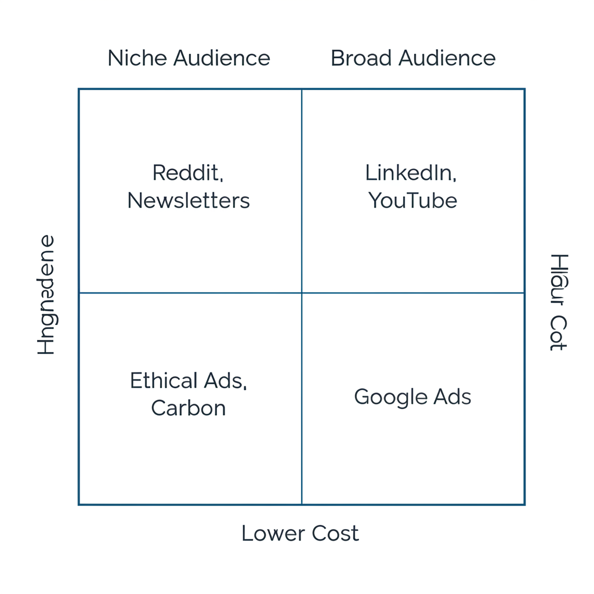

# Paid Advertising for Developer Tools

A comprehensive guide to running effective paid ads for developer audiences. From fundamentals to advanced channel-specific tactics.

---

## Part 1: Foundational Principles

### The Developer Advertising Truth

Developers are different. Traditional B2B tactics often fail.

**Core principles:**
- Focus on relevance and practicality over snappy copy
- Spend time on targeting the right people
- Filter places where your ads will be shown
- Don't try to impress — try to help

> "Don't try to impress us, try to help us. Don't make it feel like marketing. Let us get our hands dirty with your product." — From Kelsey Hightower's discussion on what marketing works on developers

### What Developers Respond To

- **Practical value over polish**
- **Authentic education over corporate messaging**
- **Hands-on product experience**
- **Transparency and utility**
- **Problem-solving over persuasion**

### When Paid Ads Make Sense

1. **Capturing existing demand** — People searching for solutions
2. **Retargeting engaged users** — Bringing back those who showed interest
3. **Awareness in niche communities** — Reaching developers where they gather
4. **Scaling what organically works** — Amplifying proven messages

---

## Part 2: Channel Selection Framework

### How to Evaluate a Channel

Ask three questions (Adam Grenier framework):

1. **Is your audience really there?**
2. **What is special about the content people consume there?**
3. **How does content there connect to your product?**

### Channel-by-Channel Analysis

**Reddit:**
- Developers are there in specific subreddits
- Content is discussion-based, authentic
- Good for: niche targeting, community integration

**LinkedIn:**
- Decision-makers and senior devs
- Content is professional, career-oriented
- Good for: enterprise, B2B dev tools

**Twitter/X:**
- Developer conversations, tech news
- Content is fast, opinion-driven
- Good for: dev-focused products, thought leadership

**YouTube:**
- Tutorial consumers, deep learning
- Content is educational, long-form
- Good for: complex products, demos

**Newsletter Sponsorships:**
- Engaged, opted-in audiences
- Content is curated, trusted
- Good for: relevant niche products

**Developer Ad Networks (Ethical Ads, Carbon):**
- Developer-focused sites
- Content is contextual
- Good for: broad dev reach, OSS-adjacent

---

## Part 3: Reddit Ads Deep Dive

### Why Reddit Works for Dev Tools

- Highly engaged communities
- Authentic discussions
- Subreddit targeting = precise audiences
- Comments allowed on ads

### Reddit Ad Types That Work

**1. The Meme Ad**
Use developer humor that resonates with the subreddit culture. Must feel native, not corporate.

**2. The Educational Post**
Share genuinely useful information with subtle product mention.

**3. The Direct Pitch (when relevant)**
For solution-aware audiences, direct pitches work if honest.

### Reddit Ad Best Practices

**Targeting:**
- Target specific subreddits, not broad interests
- Start with 3-5 highly relevant subreddits
- Exclude irrelevant ones

**Creative:**
- Allow comments (Zesty approach)
- Use native Reddit styling
- Be authentic, avoid corporate speak
- Self-deprecating humor works

**Copy:**
- Get to the point
- Use subreddit language
- Don't oversell

### Reddit Ads Case Studies

**Zesty Example:**
"Reddit ads don't suck" campaign — used authentic, meme-style creative that felt native to Reddit culture.

**What worked:**
- Embraced Reddit humor
- Didn't try to look like traditional ads
- Engaged in comments

---

## Part 4: LinkedIn Ads

### LinkedIn for Dev Tools

Good for:
- Enterprise dev tools
- Platform/infrastructure products
- Reaching engineering managers and CTOs
- B2B developer products

### Creative Formats That Work

**1. Meme-style ads (Aikido)**
Developer-relevant humor in LinkedIn format. Stands out in professional feed.

**2. TikTok-style video ads**
Short, punchy videos that feel native to social rather than "produced."

**3. Architecture diagrams + explanation**
Devs like diagrams. Complex concept in one visual = shareable.

**4. Screenshot ads**
Real product screenshots showing value.

### LinkedIn Playbook

**Targeting:**
- Job titles: Software Engineer, DevOps, Platform Engineer
- Skills: Specific technologies your product relates to
- Company size: Match your ICP
- Seniority: Engineering managers for enterprise

**Content tips:**
- Diagrams perform well
- "Architecture + explanation" format
- Use technical jargon appropriately

### The CEO/Founder Playbook

Use founder LinkedIn presence to amplify paid efforts:
- Thought leadership posts
- Engage with comments
- Share learnings authentically
- Mix personal and professional

---

## Part 5: YouTube Strategies

### YouTube for Dev Tools

**Two main approaches:**
1. **Ads:** Pre-roll, in-feed
2. **Sponsorships:** Influencer integrations

### YouTube In-Feed Ads

B2B pricing tips example showed in-feed ads performing well for dev tools — appearing in YouTube search results alongside tutorials.

### YouTube Influencer Playbook (Clerk Masterclass)

**How to work with dev influencers:**

1. **Identify influencers**
   - Start with who you already know
   - Look at who creates content in your space
   - Check engagement, not just subscribers

2. **Outreach**
   - Be direct about what you want
   - Explain why you're reaching out to them specifically
   - Have a clear budget range

3. **Integration types:**
   - Dedicated video (most expensive, highest impact)
   - Sponsored segment (30-90 seconds in existing video)
   - Integration (natural product use in tutorial)

4. **What to look for:**
   - Authenticity
   - Audience match
   - Previous sponsor experience
   - Production quality

5. **Measurement:**
   - Custom landing pages
   - Promo codes
   - UTM tracking
   - Brand lift surveys

---

## Part 6: Newsletter Sponsorships

### Why Newsletter Sponsorships Work

- Highly engaged audiences
- Trust transfer from creator
- Contextual relevance
- Less banner blindness

### What Great Newsletter Ads Look Like

**Trieve example in Cassidy Williams newsletter:**

Structure:
1. **"What is it"** — No-fluff product description, HN-style
2. **"What it compares to"** — Anchor to known tool
3. **"Why should I care"** — Value proposition with live demo
4. **"How can I test it"** — Free credits offer

**Key traits:**
- Written by/for devs
- To the point
- Offers try-before-buy

### Newsletter Sponsorship Tips

- Match newsletter audience to your ICP
- Write copy in the newsletter's voice
- Provide clear, easy-to-redeem offer
- Track with unique codes/links

---

## Part 7: Developer Ad Networks

### Ethical Ads

Developer-focused ad network. Key learnings:

**Following their guidelines works:**
One company saw 6x improvement in CTR by following Ethical Ads' creative guidelines.

**Best practices:**
- Use their recommended formats
- Keep copy developer-focused
- Context matters — ads appear on dev sites

### Carbon Ads

Similar to Ethical Ads but different network of sites.

### Comparison Tables in Ads

**Format that works:** Show feature comparison table as ad creative. Devs like to see concrete differences.

---

## Part 8: Retargeting

### Retargeting for Developers

While gated content underperforms with devs, retargeting works for maintaining top-of-mind awareness.

### What to Retarget With

**Middle-of-funnel content:**
- Docs
- Integration quickstarts
- Case studies
- Video tutorials

Not: gated ebooks, webinar registrations

### Retargeting Strategy

1. **Website visitors** → Show docs/quickstarts
2. **Doc readers** → Show integration guides
3. **Integration explorers** → Show case studies
4. **Engaged but not converted** → Show sandbox/trial

---

## Part 9: Measuring Ad Performance

### Optimization Goals

For awareness: optimize for content consumption
- Video views
- Time on site
- Scroll depth

For demand capture: optimize for signups/leads
- Trial signups
- Demo requests
- Docs visits

### Self-Reported Attribution

**Why it matters:** Software attribution misses much developer behavior (dark social, word of mouth).

**How to implement:**
- "How did you hear about us?" on signup
- Use open text, not dropdowns (better data)
- Combine with software attribution for full picture

**Advanced tricks:**
- Add "fake" option to measure baseline noise
- Run lift tests: scale one channel while keeping others constant

### Budget Allocation Rules of Thumb

From Datadog CMO:
- 70% pipeline generation / 30% brand awareness
- Headcount vs program: 50/50
- Digital vs events: 70/30 for SMB, 30/70 for enterprise
- PLG companies: higher marketing % of budget (~20%)

---

## Part 10: Ad Creative Principles

### What Works for Developer Ads

1. **Relevance over cleverness** — Solve their problem
2. **Authenticity** — Don't pretend to be what you're not
3. **Code/technical elements** — Make it feel "devy"
4. **Clear value proposition** — What do I get?
5. **Easy next step** — Try it now, read docs

### Ad Creative Inspiration

**Resources:**
- Moat.com — See what Datadog, Algolia, CircleCI use
- reo.dev — 250+ dev tool ad examples
- LinkedIn ad library — Search competitors

### The "Timer" Video Ad (Kinde)

Raw, authentic video showing:
- Timer on screen
- Building something with the product
- Real-time demonstration

Feels authentic, not produced.

### The Comparison Table Ad

Show your product vs alternatives in a simple table. Devs like concrete comparisons.

---

## Quick Reference: Channel Comparison

| Channel | Best For | Cost Level | Targeting |
|---------|----------|------------|-----------|
| Reddit | Niche communities | Low-Medium | Subreddits |
| LinkedIn | Enterprise, B2B | High | Job titles, skills |
| YouTube | Complex products | Medium-High | Interests, channels |
| Newsletters | Niche audiences | Medium | Publisher audience |
| Ethical Ads | Broad dev reach | Low | Developer sites |
| Google | Demand capture | High | Keywords |

---

## Checklist: Running Dev Tool Ads

### Before You Start
- [ ] Clear ICP defined
- [ ] Value prop validated organically
- [ ] Tracking/attribution set up
- [ ] Self-reported attribution implemented
- [ ] Budget allocated

### Campaign Setup
- [ ] Right channel for your audience
- [ ] Targeting matches ICP
- [ ] Creative follows developer principles
- [ ] Landing page optimized
- [ ] Retargeting audiences created

### Ongoing
- [ ] Monitor performance daily initially
- [ ] Read comments (on Reddit)
- [ ] Iterate creative based on data
- [ ] Test new formats regularly
- [ ] Report with combined attribution

---

## Resources

### Inspiration
- Moat.com (search Datadog, Algolia, etc.)
- reo.dev (dev tool ads gallery)
- LinkedIn Ad Library

### Guides Referenced
- Ethical Ads advertiser guide
- Reddit advertising best practices
- YouTube influencer marketing playbook

---

## Resources & Further Reading

**Reddit Ads:**
- [Testing Reddit Ads for Developer Personas](https://www.linkedin.com/posts/aayildirim_weve-been-testing-reddit-ads-for-a-few-clients-activity-7213874084890243072-QHXL) — Ali Yildirim
- [Measuring Reddit Ads Beyond Clicks](https://www.linkedin.com/posts/itamar-ben-yair-053271174_i-recently-launched-a-reddit-campaign-for-activity-7236964970062639104-pnc1) — Itamar Ben-Yair
- [How I Accidentally Cracked Reddit](https://www.linkedin.com/posts/maddiewang_heres-how-i-accidentally-cracked-reddit-activity-7279629663423942656-_PcP) — Maddie Wang

**LinkedIn Ads:**
- [TikTok-Style Video Ads on LinkedIn](https://www.linkedin.com/posts/itamar-ben-yair-053271174_all-too-often-b2b-startups-avoid-light-and-activity-7215580301685641216-4PEl)
- [Running Ads to Dev Content vs Landing Pages](https://www.linkedin.com/posts/oklochai_leadgen-devrel-activity-7090372869821448192-RzuT)

**YouTube Influencers:**
- [How Clerk Partners with YouTube Creators](https://playbooks.hypergrowthpartners.com/p/how-clerk-partners-with-youtubes)
- [Dev Influencer Marketing Playbook](https://www.linkedin.com/feed/update/urn:li:activity:7130171544818831361/) — Itamar Ben-Yair

**Tools & Resources:**
- [Ethical Ads Advertiser Guide](https://www.ethicalads.io/advertiser-guide/)
- [140+ Developer Newsletters to Sponsor](https://bitreach.notion.site/Developer-Newsletters-1320315a0f314e76b2016b39359cb560)
- [Moat Ad Creative Inspiration](https://moat.com/advertiser/datadog)
- [Dev Tool Ad Gallery](https://picturesque-macrame-365.notion.site/Ad-breakdowns-89a4ab4339784b58bb13c15793b7d326) — Zachary Short

**Podcasts:**
- [Going Deepear Into Dev Marketing](https://open.spotify.com/show/0wyxDG8BkClv5XltUiZdbD) — Episodes on LinkedIn video ads
- [How to Market to Developers (CTO Perspective)](https://open.spotify.com/episode/2F7kxv8CWTNfbIirQU7d5C)
