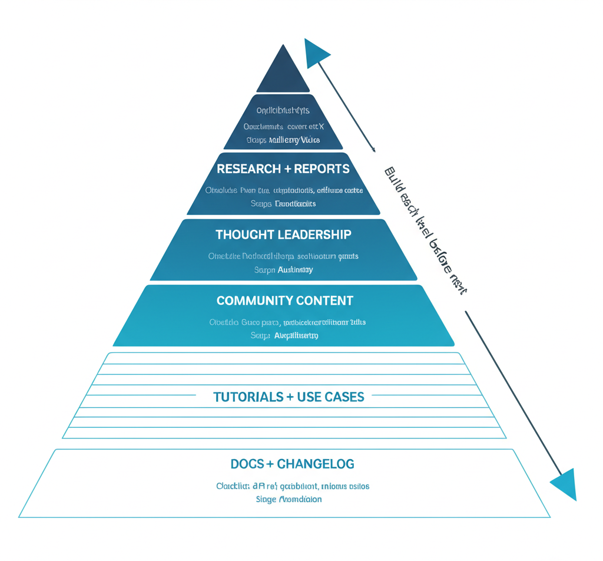
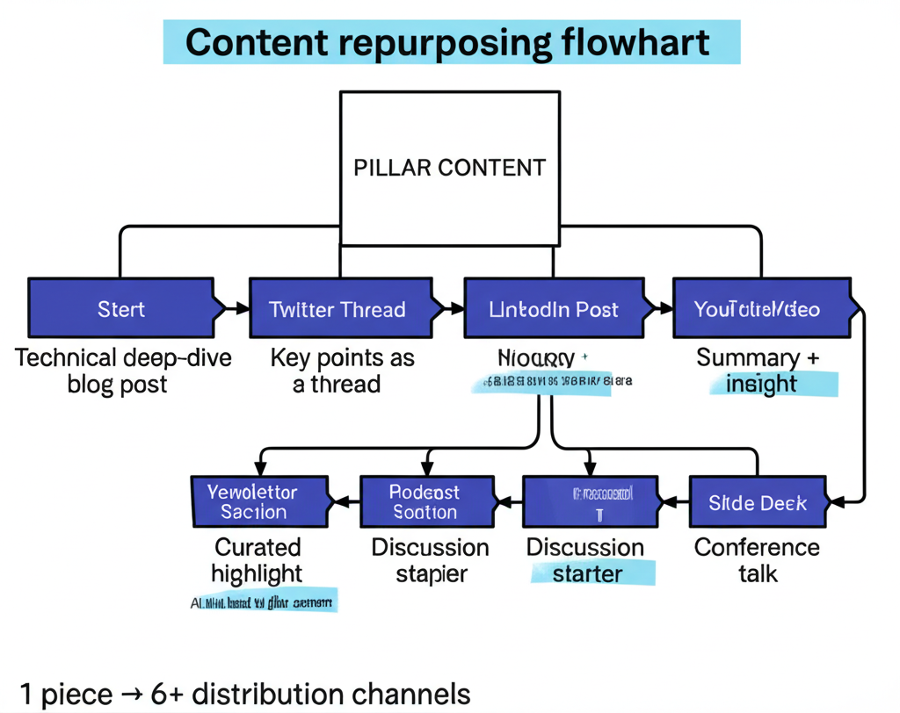

# Content Marketing for Developer Tools

A comprehensive guide to creating content that developers actually want to read. From content types to distribution strategies.

---

## Part 1: Content Philosophy

### Writing for Developers

Developers are different readers:
- They want "how-to" code, not business value
- They prefer specific over general
- They appreciate technical depth
- They detect fluff instantly

> "Don't be too high-level and talk about the business value or benefits — show me the 'how-to' code."

### The One Reader Principle

Write for "one developer." Share a story that makes it obvious this article is written for them specifically.

**Key elements:**
- Clear introduction about what the article covers
- Know the one thing you want readers to remember
- End with suggestions for related content

### Hiring Developers as Writers

**Auth0 approach:** Hire developers at normal dev salary to write articles full-time.

**Pitch to developers:** You'll learn and explore things you didn't have time for in a regular dev job.

**Result:** Authentic technical content at scale.

---

## Part 2: Content Types That Work



### The Debugging Story

One of the best content types for senior developers.

**GitLab example:** Article about how a Go fix sped up their service by 30x.

**Structure:**
1. The symptom we noticed
2. What we investigated
3. What we tried that didn't work
4. The actual root cause
5. The fix
6. What we learned

**Why it works:**
- Authentic
- Educational
- Shows technical depth
- Shareable

### The Jobs-to-Be-Done Post

**WorkOS example:** Masterclass in JTBD content.

**Structure:**
1. The job to be done (not feature)
2. Why it matters
3. How to accomplish it
4. Where the product helps

### The "How We Built X" Post

Popular on Hacker News.

**Structure:**
1. What we built
2. The constraints we faced
3. Approaches we considered
4. Why we chose our approach
5. Technical details
6. What we'd do differently

### The Comparison Post

Developers search competitively.

**Structure:**
1. Honest comparison of options
2. When to choose each
3. Your take (but honest)

### The Tutorial

Classic but still works.

**Best practices:**
- Specific outcome
- Copy-paste code
- Real working example
- Troubleshooting tips

---

## Part 3: Content Frameworks

### keyBoard / whiteBoard / Boardroom

Create content for each audience:

| Type | Audience | Content |
|------|----------|---------|
| keyBoard | Individual dev | How-to, tutorials, code examples |
| whiteBoard | Architect | Design patterns, architecture guides |
| Boardroom | CTO/VP | ROI, case studies, risk mitigation |

### The Radiating Circles

**Product → Docs → Content → Community**

Content is the third circle. Ensure product and docs are solid before investing heavily.

### Content Maturity Levels

**Level 1:** Problem-aware content
- "What is X?"
- "Why X matters"

**Level 2:** Solution-aware content
- "How to solve X"
- Tutorials, guides

**Level 3:** Product-aware content
- "How to solve X with [Product]"
- Integration guides

**Level 4:** Thought leadership
- Original research
- Industry perspectives
- Deep technical dives

---

## Part 4: Content Distribution



### SEO for Developers

**Cronitor case study:** Created a page for every "run cron job + [time]" query.

**Why it works:**
- Long-tail keyword capture
- Command/error based queries are templateable
- Each page = solution + product pitch

### The Programmatic SEO Pattern

1. Identify query pattern developers search
2. Create template for answering
3. Generate pages at scale
4. Each page = small pitch for product

### Syndication Strategy

**Should you repost to Medium/Dev.to?**

**Pros:**
- Built-in audience
- SEO benefits (canonical link)
- Discovery

**Cons:**
- Traffic goes there, not your site
- Limited control

**Guidance:** Syndicate with canonical links to your site.

### Newsletter Distribution

Your own newsletter is valuable for:
- Direct relationship with developers
- Ability to promote new content
- Feedback channel
- Community building

---

## Part 5: Blog Design & CTAs

### Blog Sidebar Design

**Purpose:** Keep readers engaged and guide next actions.

**What to include:**
- Related posts
- Newsletter signup
- Product CTA (subtle)
- Popular posts

### Blog CTAs That Work

**The balance:**
- Too aggressive: Developers ignore
- Too subtle: No conversion

**V7 approach:** CTAs that are relevant but not "obviously an ad."

**CTA placement:**
- After introduction (for long posts)
- Within relevant sections
- At end of article
- Sidebar (persistent)

### Top of Article Pattern

After reading, suggest:
- "If you have time, you may also want to read about XYZ"

This keeps developers on site and builds expertise perception.

---

## Part 6: SEO Strategy

### The Digital Ocean Content Strategy

**Key learnings:**
- Massive tutorial library
- SEO-focused titles
- Consistent format
- Deep technical content

### Snyk Advisor Case Study

SEO-driven product growth through:
- Package analysis pages
- Security vulnerability pages
- Generated at scale
- Each page = product introduction

### Engineering-as-Marketing

Create free tools that rank:
- **ElevenLabs:** Speech-to-text tools targeting keyword searches
- **Auth0:** JWT debuggers
- **Algolia:** Hacker News search

**New opportunity:** AI-powered platforms (Lovable, Replit, v0) enable marketers to build tools independently.

### GitHub Search Optimization

**Key factors:**
- "About" section keywords (% of keywords to total words matters)
- Topics (one-word, extend About coverage)

---

## Part 7: Content for Different Channels

### LinkedIn Content

**What works:**
- Architecture diagrams + explanation
- Personal founder stories
- Dev tool learnings
- Memes (yes, memes)

**Format tips:**
- Hook in first line
- Validation in middle
- Push to comments/link

### Twitter/X Content

**Supabase approach:**
- Understand audience
- Memes and jokes for devs
- Dev jargon
- Visual tweets that pop

**Tweet thread format:**
1. Hook with story
2. Validate with middle
3. Push to next tweet

### Diagrams

**Why they work:**
- "Smell" like value
- Highly shareable
- People want to feel smart/helpful

Even low-quality diagrams get shared if they appear valuable.

---

## Part 8: Thought Leadership

### The Authority Building Path

1. **Share learnings publicly**
2. **Create original research**
3. **Own a topic/problem space**

**Neo4j example:** Graph database newsletter that owned "graph thinking" before pushing product.

### Research-Based Content Factory

**Examples:**
- **jFrog:** Developer security surveys
- **Tailscale:** Technical deep dives

**Process:**
1. Conduct research (surveys, data analysis)
2. Publish findings
3. Get industry coverage
4. Become the source

### Alpha Developer Strategy

Target "alpha developers" who speak to other devs.

These are:
- Active in communities
- Write/speak publicly
- Influence tool decisions

Content that reaches them spreads organically.

---

## Part 9: Content Operations

### Content Calendar

**Cadence options:**
- Weekly: Maintains momentum
- Bi-weekly: Sustainable quality
- Monthly: Deep, comprehensive

**Mix content types:**
- 60% tactical tutorials
- 20% thought leadership
- 10% product announcements
- 10% community content

### Repurpose Strategy

**Sales conversations → Content:**
Convert effective sales explanations into self-serve content.

**One piece → Multiple formats:**
- Blog post → Twitter thread
- Blog post → LinkedIn post
- Blog post → Newsletter section
- Blog post → Video script

### Content Measurement

**What to track:**
- Traffic (by source)
- Time on page
- Scroll depth
- Signups attributed
- Self-reported attribution mentions

---

## Part 10: Getting Started

### The Minimum Viable Content Strategy

1. **One excellent tutorial** solving common problem
2. **One case study** with real customer
3. **One "how we built X"** showing technical depth
4. **Consistent publishing** (even if monthly)

### Building the Team

**Options:**
- Developer advocates who write
- Developers paid to write (Auth0 model)
- Technical writers with dev background
- Freelance dev writers

### Content Tools

**Writing:**
- Notion/Google Docs for collaboration
- Grammarly for editing
- Code snippet tools (Carbon, Snappify)

**Distribution:**
- Buffer/Hootsuite for social
- ConvertKit/Beehiiv for newsletters
- Your blog platform

---

## Quick Reference: Content Checklist

### Before Writing
- [ ] Clear audience defined
- [ ] One key takeaway identified
- [ ] Format chosen (tutorial, story, etc.)
- [ ] Distribution plan ready

### During Writing
- [ ] Technical depth appropriate
- [ ] Code examples included
- [ ] Screenshots where helpful
- [ ] CTAs placed thoughtfully

### After Publishing
- [ ] Distributed on social
- [ ] Added to newsletter
- [ ] Shared with community
- [ ] Tracked in analytics

---

## Templates

### Tutorial Structure

```markdown
# How to [Accomplish X] with [Tool/Technology]

## What You'll Learn
[One sentence outcome]

## Prerequisites
- [Requirement 1]
- [Requirement 2]

## The Problem
[Brief context]

## Step 1: [First Action]
[Explanation]
\`\`\`code
example
\`\`\`

## Step 2: [Continue]
...

## The Result
[Show outcome]

## What's Next
[Related content]
```

### Debugging Story Structure

```markdown
# How We Fixed [Problem] and [Result]

## The Symptom
[What we noticed]

## Investigation
[What we looked at]

## What Didn't Work
[Failed approaches]

## The Root Cause
[Actual problem]

## The Fix
[Solution with code]

## Lessons Learned
[Takeaways]
```

---

## Resources & Further Reading

**Content Strategy:**
- [Deep Dive into DigitalOcean Content Strategy](https://www.developermarkepear.com/blog/developer-content-marketing)
- [keyBoard vs whiteBoard vs Boardroom Content](https://open.spotify.com/episode/0Wea46SI0HUIU16wbCH524) — William Chia podcast
- [Writing Good Developer Content](https://www.devrelx.com/post/content-that-developers-love)

**Content Types:**
- [GitLab Debugging Story Example](https://about.gitlab.com/blog/2018/01/23/how-a-fix-in-go-19-sped-up-our-gitaly-service-by-30x/)
- [JTBD Blog Post Masterclass (WorkOS)](https://www.developermarkepear.com/developer-marketing-examples/jtbd-blog-post-from-workos)

**SEO & Distribution:**
- [Snyk Advisor SEO Growth Loop](https://www.linkedin.com/feed/update/urn:li:activity:7052552621915529217/) — Ben Williams
- [FIRE Framework for Measuring Content Marketing](https://hypergrowthpartners.substack.com/p/fire-framework-for-measuring-content-marketing) — Jared Waxman
- [Should You Repost to Medium/Dev.to?](https://www.linkedin.com/posts/oklochai_is-it-worth-reposting-articles-from-your-activity-7162790028434104320-1mGo) — (Answer: No impact)

**Podcasts:**
- [Growing a Developer Blog to 3M Annual Visitors](https://open.spotify.com/episode/0TQjsZ00JtrB8NLcGN6nFM) — Jakub Czakon (Neptune.ai)
- [Pipeline Podcast with Gonto (Auth0)](https://pipelinepodcast.drift.com/public/13/Pipeline-e517a8b2/d6511ad9) — Hiring devs to write content

**Developer Behavior:**
- [How Developers Stay Up to Date](https://www.youtube.com/watch?v=00dOSfrc_Hw) — Jono Bacon
- [How Developers Consume Content](https://www.youtube.com/watch?v=LG3bY9vmxmg) — Jono Bacon
