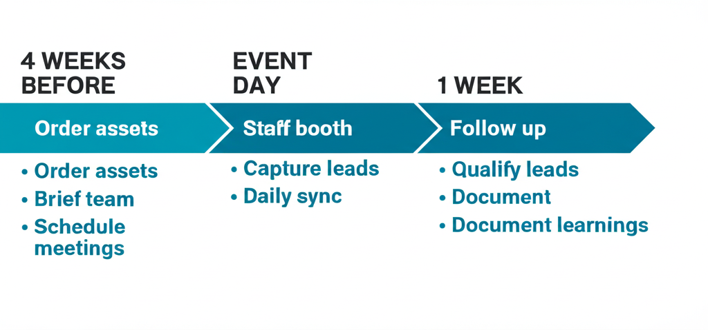

# Events & Conferences for Developer Tools

A comprehensive guide to conference marketing. From booth design to zero-budget guerrilla tactics.

---

## Part 1: Why Events Matter

### The Value of In-Person

In developer marketing, events provide:
- Face-to-face trust building
- Deep product conversations
- Community relationship building
- Content opportunities (talks, recordings)
- Competitive intelligence

### Event Types

1. **Industry conferences** (KubeCon, AWS re:Invent)
2. **Community meetups** (local tech meetups)
3. **Your own events** (launch events, dinners)
4. **Partner events** (co-hosted with complementary tools)
5. **Virtual events** (webinars, online conferences)

---

## Part 2: Conference Booth Strategy




### Booth That Works

**Key elements:**
- Clear value prop visible from distance
- Interactive demo stations
- Swag with purpose (not junk)
- Knowledgeable staff

### Interactive Demos

**Best practice:** Let developers actually use your product at the booth.

Set up:
- Quick demo flow (5-10 minutes max)
- Pre-configured environment
- Success moment they can achieve
- Follow-up capture

### Booth Staff

**Who should work the booth:**
- Engineers who can go deep
- Marketers who can qualify
- Mix of personalities

**Tips:**
- Rotate to prevent burnout
- Brief on key messages
- Set lead capture goals

---

## Part 3: Zero-Budget Conference Marketing

### The Walking Billboard

**Case study:** "How I marketed to 2,000 prospects for ~$0"

**Approach:**
- Simple t-shirt with value prop + QR code
- Wear it, walk around
- Start conversations

**Why it works:**
- Being dramatically different > incrementally better
- Zero cost, high visibility
- Natural conversation starter

### Custom Demos for Other Vendors

**Tactic:** Build awesome customized demos for other vendors' booths.

**Process:**
1. Reach out to vendors before conference
2. Offer to build demo that uses your product
3. They get great demo content
4. You get exposure

**Results:** One founder got 8/25 replies, 4 ended up doing it.

### Custom Demos for Speakers

**Same approach for speakers:**
- Offer to build demo for their talk
- Their talk features your product naturally
- Higher credibility than booth

---

## Part 4: Swag Strategy

### Swag That Works

**Principles:**
- Useful > clever
- Connected to product > generic
- Quality > quantity
- Memorable > forgettable

### Swag Ideas That Hit

**Mechanical keyboard with branded key (Parabola):**
- Replace Enter key with logo in brand colors
- Metaphorical: automation → execution
- Useful, memorable, shareable

**Hand-iced cookies with product visuals:**
- Custom cookies with charts from product
- Gives people excuse to share at work
- Triggers Slack conversations

**Coconut water (Datafold):**
- Unexpected
- Practical at hot conferences
- Memorable

### The T-Shirt Formula

**Developer t-shirts should be:**
- Something they'd actually wear
- Not overly promotional
- Clever or technical reference
- Quality fabric

**T-shirt gallery:** Look at devy t-shirt galleries for inspiration.

### Swag Giveaway Campaigns

**Big prize vs. many small prizes:**

One big prize can get better ROI than many small ones.

**NannyML example:** Monitoring tool gave away monitoring setup.
- Went viral
- Connected to product value
- Worth talking about

---

## Part 5: Conference Talks

### Getting Talks Accepted

**Key elements of good proposal:**
1. Clear, specific title
2. What attendees will learn
3. Why you're qualified
4. Why it's timely
5. Takeaways they can use

### Talk Content

**What works:**
- Teaching something practical
- Sharing real experience (debugging story)
- Novel technical approach
- Behind-the-scenes of known systems

**What doesn't work:**
- Thinly veiled product pitches
- Too high-level/generic
- Already been done many times

### Promoting Your Talk

Before:
- Share on social
- Tell your community
- Invite prospects personally

During:
- Live tweet key points
- Encourage attendee posts

After:
- Share slides
- Post recording when available
- Write blog post version

---

## Part 6: Hosting Your Own Events

### Small Exclusive Dinners

**The case for small:**
- 20-30 people
- Not recorded
- Super focused conversations
- Quality over quantity

**The CTA:** After the dinner, invite to community Slack.

### Event Registration Promotion

**Vercel approach:** Put event registration CTA right in the header.

For super important events, the header is the most viewed part of the most visited page.

### Launch Events

**Supabase launch weeks:** Condense announcements to create momentum and mindshare.

**Elements:**
- Multiple announcements throughout week
- Build to biggest reveal
- Community engagement throughout

---

## Part 7: Virtual Events

### Webinar Best Practices

**Registration:**
- Don't gate everything
- Simple form (name, email, company)
- Clear value in title

**Content:**
- Educational first
- Product demo natural, not forced
- Q&A time generous

### Virtual Conference Presence

When sponsoring virtual events:
- Pre-record high-quality content
- Have team ready in chat
- Clear CTAs in sponsor content
- Follow up promptly

---

## Part 8: Pre/Post Conference

### Before the Conference

**Outreach:**
- Email customers/prospects who might attend
- Offer meetings at booth
- Promote any talks you're giving

**Preparation:**
- Demo environment tested
- Lead capture system ready
- Staff briefed
- Swag shipped

### At the Conference

**Daily:**
- Team sync on what's working
- Rotate booth staff
- Capture learnings real-time
- Social media active

### After the Conference

**Within 48 hours:**
- Send follow-up emails
- Connect on LinkedIn
- Qualify leads

**Within 1 week:**
- Detailed follow-ups
- Book meetings
- Share content from event

**Longer term:**
- Nurture sequence
- Add to newsletter
- Build relationship

---

## Part 9: Measuring Event ROI

### What to Track

**Quantitative:**
- Leads captured
- Meetings booked
- Pipeline generated
- Deals closed

**Qualitative:**
- Conversation quality
- Product feedback
- Competitive intel
- Brand awareness

### Attribution Challenges

Events are often first touch, not last touch.

**Approach:**
- Track pipeline sourced
- Self-reported attribution
- Compare to non-event periods
- Value relationship building

### Budget Allocation

**From Datadog CMO:**
- SMB: 70% digital, 30% events
- Enterprise: 30% digital, 70% events

Events matter more for enterprise sales.

---

## Part 10: Event Marketing Without a Booth

### Guerrilla Tactics

**At competitors' booths:**
- Wear your t-shirt
- Be friendly, not aggressive
- Start conversations nearby

**After-parties:**
- Host or sponsor happy hours
- Unofficial meetups
- Find where devs gather

### Content Capture

**Turn conferences into content:**
- Interview attendees
- Live reactions
- Behind-the-scenes
- Key takeaways thread

### Community Building

**Use events to:**
- Meet community members IRL
- Host community meetup
- Strengthen online relationships

---

## Quick Reference: Event Checklist

### Pre-Event (4 weeks out)
- [ ] Booth assets ordered
- [ ] Swag ordered and shipped
- [ ] Team registered and briefed
- [ ] Demos prepared and tested
- [ ] Outreach to prospects sent
- [ ] Meetings pre-scheduled

### At Event
- [ ] Booth setup and tested
- [ ] Lead capture working
- [ ] Staff rotation scheduled
- [ ] Social media active
- [ ] Daily sync with team

### Post-Event (1 week after)
- [ ] All leads in CRM
- [ ] Follow-up emails sent
- [ ] LinkedIn connections made
- [ ] Meetings scheduled
- [ ] ROI metrics captured
- [ ] Learnings documented

---

## Templates

### Conference Follow-Up Email

```
Subject: Great meeting you at [Conference]

Hi [Name],

It was great chatting at [Conference] about [topic you discussed].

As I mentioned, [Product] can help with [specific problem they mentioned].

Here's that [resource/link] I promised: [link]

Would love to continue the conversation. Do you have 30 minutes
next week to dig deeper?

[Calendar link]

Best,
[Your name]
```

### Speaking Proposal Template

```
Talk Title: [Clear, specific title]

Abstract:
[2-3 sentences on what you'll cover]

What Attendees Will Learn:
1. [Takeaway 1]
2. [Takeaway 2]
3. [Takeaway 3]

Why This Talk:
[Why it's timely and relevant]

About Me:
[Brief bio with relevant experience]

Talk Level:
[Beginner / Intermediate / Advanced]
```

---

## Resources & Further Reading

**Conference Strategy:**
- [Why Go to Conferences (Gonto, Auth0)](https://open.spotify.com/episode/6yK0Dc5yk0ZDLwCB5Kj0qA) — Focus on influencers/speakers
- [DX.tips Conference Guide](https://dx.tips/conf-guide) — Creating memorable experiences
- [How I Marketed to 2,000 Prospects for ~$0](https://michaeldrogalis.substack.com/p/how-i-marketed-to-2000-prospects) — Guerrilla tactics

**Case Studies:**
- [Wiz CMO on Building Fastest-Growing Startup](https://open.spotify.com/episode/6LYRIzdsSZxEQzJ2mB5t3s) — Lenny's Podcast
- [Wiz Supermarket Booth at RSAC](https://www.linkedin.com/posts/wizsecurity_rsac-activity-7194345128289849345-obYZ)
- [Terminal Shop at React Miami](https://youtu.be/kpFg3JtrMW8) — Terminal Feud activation

**Podcasts:**
- [Code to Market on Terminal Shop Stunts](https://open.spotify.com/episode/3I8rDE5dTzBG4IIayUhWJF)
- [Build by OpenView: Auth0's Conference Strategy](https://podcast.openviewpartners.com/public/32/OV-%7C-BUILD-21cbd466/9a2447b9)
