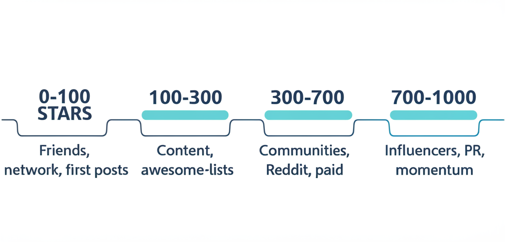
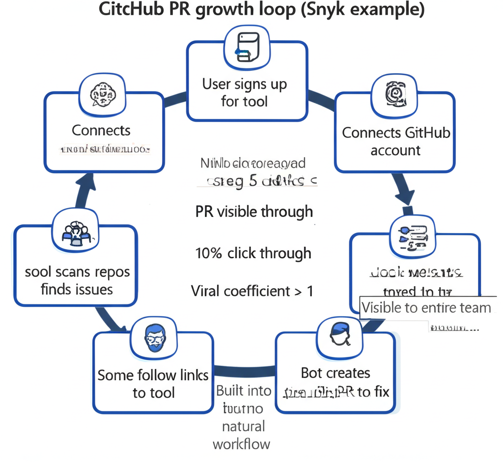

# Open Source & GitHub Marketing

A comprehensive guide to growing open source projects and leveraging GitHub for marketing. From first stars to sustainable growth.

---

## Part 1: Why Open Source Matters

### Open Source as Differentiator

> "If a developer can pick software that is also open source, it's just better."
> — James Hawkins, PostHog

**Why developers prefer OSS:**
- Code is inspectable
- Can verify claims
- Can contribute/customize
- No vendor lock-in fears
- Community validation

### Open Source GTM

**The master plan pattern (from Resend):**
1. Launch open-source project around [domain]
2. Establish yourselves as experts around [domain]
3. Launch SaaS around [domain]

---

## Part 2: Getting Your First 1000 Stars




### Prerequisites: Repo Health

Before marketing, ensure:
- **Clear description** of what your tool does
- **Well-structured README:** What you do, code snippets, UI gifs
- **Docs site** you want to send people to

### The First 100 Stars: Artificial Growth

Kick-off sources:
- Friends and family message
- Neighbors in shared office space
- Show it off (free) at conferences
- First launch announcements on social

### Beyond 100: Organic Growth

**Content creation:**
- Present the tool directly and indirectly
- Listicles ("10 tools for X")
- Tutorials using your tool

**Content distribution:**
- Syndication (Medium, Dev.to)
- Reddit and socials
- Your own blog (SEO)

**GitHub lists:**
- PR to get on every relevant list
- awesome-* lists
- curated collections

**Communities and dark social:**
- Slack, Discord, Reddit
- WhatsApp groups
- LinkedIn and Facebook groups

**Paid campaigns:**
- Ethical Ads
- Reddit (subreddits)
- Twitter (keywords)

**Influencers:**
- List relevant influencers
- Find collaborative opportunities
- Reach out directly

---

## Part 3: The GitHub PR Growth Loop




### How It Works (Snyk Example)

1. New user signs up for Snyk
2. They connect their GitHub account
3. Snyk finds vulnerabilities in their repos
4. Snyk-bot creates branded PR to fix them
5. Other devs in org see and interact with PR
6. Some follow links to check out Snyk
7. Some sign up for Snyk

**Why it's powerful:**
- Uses existing developer workflow
- Visible to entire team
- Natural, not intrusive
- Creates internal awareness

### Designing Growth Loops

**Key elements:**
- Triggered by natural user behavior
- Visible to other potential users
- Provides value (not just exposure)
- Easy to act on

---

## Part 4: GitHub Search Optimization

### How GitHub Search Works

Ranking factors:
- **About section:** Keywords matter, but so does keyword density
- **Topics:** Extend search term coverage
- **Stars:** Social proof signal
- **Activity:** Recent commits matter

### Optimization Tactics

**About section:**
- Put keywords in About
- Keep it as short as possible
- % of keywords to all terms matters

**Topics:**
- Use one-word topics
- Extend what you used in About
- Cover more search terms

---

## Part 5: README Strategy

### README Structure

**For open source project launch (from Resend):**

Spend 1 week on the library, 3 weeks on website and README.

**Key sections:**
1. What it is (one sentence)
2. Why it exists (problem it solves)
3. Quick start (copy-paste code)
4. Features (visual if possible)
5. Installation
6. Usage examples
7. Documentation link
8. Contributing guide
9. License

### Making README Visual

- GIFs showing tool in action
- Screenshots of UI
- Architecture diagrams
- Badges (build status, stars, etc.)

### Copy-Paste is King

> "As a developer, I want to get it up and running now. What can I copy-paste and get started as quickly as possible?"

Make installation and first use trivially easy.

---

## Part 6: Growing Traction

### Launch Tips (from Resend)

**Goal to communicate:**
"I get the use case, I get how to inject it to my project, and scale as the project/usage grows"

**Information flow priorities:**
- Readme sections
- How easy it is to get started
- How to ask for help
- What code to copy-paste

### Continuous Growth Tactics

**Retargeting experiment:**
Reach out to stargazers of similar repos. Just ask them to try yours.

**Celebrate milestones:**
Share milestones publicly. More people join a moving train.

**Shamelessly promote others:**
Promote related projects (and yours with it).

**Use case testimonials:**
Reach out to bloggers in your space. See if they'd try your tool and write about it.

---

## Part 7: Community and Contributors

### Building Contributor Community

**Make contributing easy:**
- Good first issues labeled
- Contributing guide clear
- Fast PR reviews
- Welcoming to newcomers

### Maintaining Momentum

**Regular updates:**
- Changelog visible
- Release announcements
- Roadmap public

**Community engagement:**
- Respond to issues
- Thank contributors
- Feature community projects

---

## Part 8: Open Source Monetization

### Models That Work

1. **Open core:** Core open source, enterprise features paid
2. **Cloud hosting:** Self-host free, managed cloud paid
3. **Support:** Open source free, paid support
4. **Dual license:** Open source for OSS, commercial for commercial

### Positioning Open Core

From Retool's clarity:
- "Cloud (we host)"
- "Self-hosted (you host)"

Make the difference crystal clear.

### Self-Hosted in Navigation

**n8n tactic:** Put self-hosted deployment guidance in docs tab dropdown.

This frontloads a key differentiator where developers look.

---

## Part 9: Measuring Open Source Success

### Vanity vs Valuable Metrics

**Vanity (but still useful):**
- Star count
- Fork count
- Contributor count

**Valuable:**
- Active users
- Issues resolved
- Community contributions
- Conversion to paid

### Star vs Usage

Stars don't equal usage. Track:
- Downloads
- Active installations
- API calls (if applicable)
- Community activity

---

## Part 10: GitHub Features for Marketing

### Sponsors

- Enable GitHub Sponsors
- Visible social proof
- Revenue source

### Discussions

- Community Q&A
- Feature requests
- Show me what you built

### Pages

- Host documentation
- Landing pages
- Showcase sites

### Actions

- Demonstrate your tool
- Template workflows
- Integration examples

---

## Quick Reference: Open Source Checklist

### Repo Foundation
- [ ] Clear, concise About
- [ ] Comprehensive README
- [ ] Good first issues labeled
- [ ] Contributing guide
- [ ] License chosen

### Growth
- [ ] Submitted to relevant lists
- [ ] Social media presence
- [ ] Community channels set up
- [ ] Milestone celebrations planned

### Conversion
- [ ] Clear path to paid product
- [ ] Self-hosted vs cloud clear
- [ ] Enterprise features documented
- [ ] Support options visible

---

## Templates

### README Structure

```markdown
# [Project Name]

[One-liner description]

## Why [Project Name]?
[Problem you solve]

## Quick Start
\`\`\`bash
npm install [package]
\`\`\`

\`\`\`javascript
// Minimal working example
import { thing } from '[package]'
thing.doSomething()
\`\`\`

## Features
- Feature 1
- Feature 2
- Feature 3

## Documentation
[Link to docs]

## Contributing
We welcome contributions! See [CONTRIBUTING.md](./CONTRIBUTING.md)

## License
[License type]
```

### Milestone Announcement

```
Exciting news! [Project] just hit [X] stars!

When we started [X months ago], we never imagined [achievement].

Thank you to:
- Our [X] contributors
- The community for feedback
- Everyone using [Project] in production

What's next:
- [Feature 1]
- [Feature 2]

Star us if you haven't: [link]
```

---

## Resources & Further Reading

**Open Source Strategy:**
- [Business of Open Source Podcast](https://www.opensourcebusiness.com/) — Emily Omier (OSS commercialization)
- [Monetizing Open Source](https://open.spotify.com/episode/0m7DUpFGGrL4R2B5c7hCX5) — Kelsey Hightower
- [Working in Public: Making and Maintenance of OSS](https://www.amazon.com/Working-Public-Making-Maintenance-Software/dp/0578675862) — Nadia Eghbal

**GitHub Marketing:**
- [How to Write a GitHub README](https://www.markepear.dev/example/how-to-write-github-readme) — Markepear
- [Detailed Creative Playbook for GitHub Stars](https://dev.to/iamludal/get-your-first-1000-github-stars-2o7e) — Dev.to
- [Prisma README Example](https://github.com/prisma/prisma) — Best-in-class README

**Growth Case Studies:**
- [Growing Resend's Open Source Traction](https://www.youtube.com/watch?v=X8P8v6mW9GM) — Zeno Rocha (Resend CEO)
- [PostHog's Open Source GTM](https://posthog.com/blog/open-source-eating-saas) — James Hawkins
- [Snyk SEO Growth Loop via GitHub](https://www.linkedin.com/feed/update/urn:li:activity:7052552621915529217/) — Ben Williams

**Tools:**
- [Awesome Lists](https://github.com/sindresorhus/awesome) — Getting on relevant lists
- [GitHub Star History](https://star-history.com/) — Track star growth
