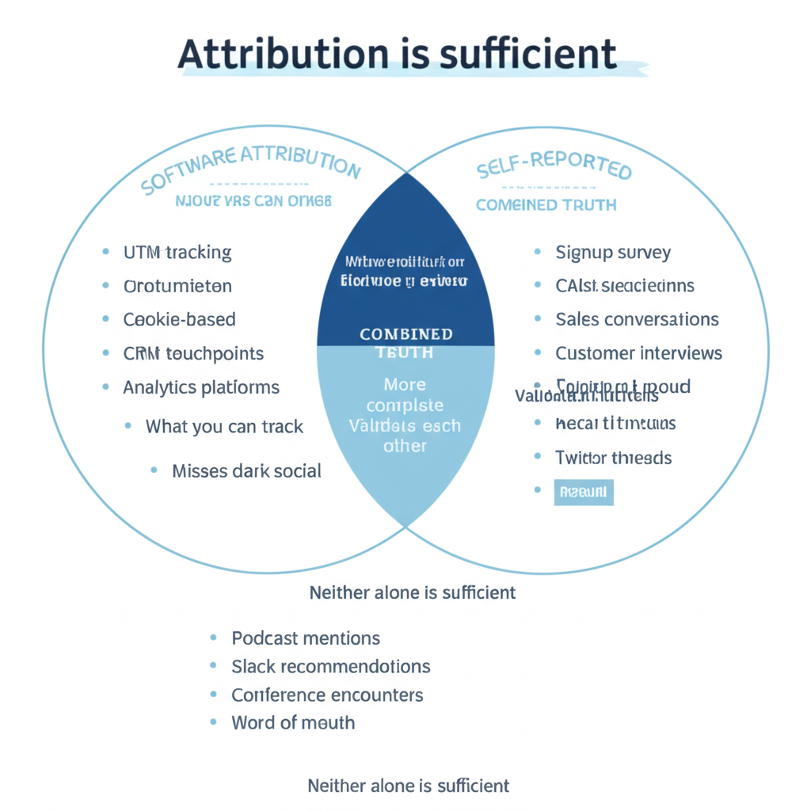
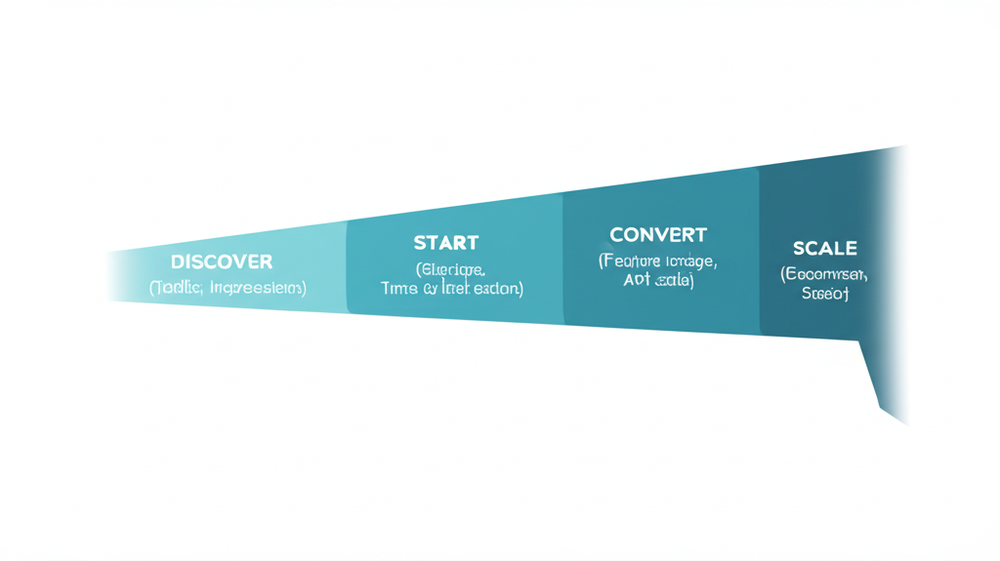

# Metrics & Attribution for Developer Marketing

A comprehensive guide to measuring developer marketing effectiveness. From KPIs to attribution strategies.

---

## Part 1: Metrics Philosophy

### The Core Principle

> Only look at metrics that help you make decisions.

If you track metrics and create dashboards but don't use them for decision-making, rethink your metrics.

### The ROI Reality

**From Rand Fishkin (founder of Moz, SparkToro):**

> "Waste 50% of your budget to get more value from the other 50%"

Accept that not everything is measurable. But still:
- Optimize impact within activities
- Justify budget for programs
- Make arguments for scaling

---

## Part 2: Attribution Fundamentals




### The Developer Attribution Challenge

Developers are hard to attribute:
- Long evaluation periods
- Multiple anonymous visits
- Dark social influence
- Word of mouth invisible
- Cookie restrictions

### The Attribution Mix

**Use both:**
1. **Software attribution:** What you can track
2. **Self-reported attribution:** What they tell you

Neither is complete. Together, they're useful.

---

## Part 3: Self-Reported Attribution

### Why Self-Reported Matters

Software attribution misses:
- Podcast mentions
- Slack recommendations
- Twitter threads
- Word of mouth
- Conference encounters

Self-reported captures what people remember as influential.

### Implementation

**When to ask:** On signup, during onboarding

**How to ask:**
- "How did you hear about us?"
- Open text field (better data) vs dropdown (easier analysis)

### Advanced Tricks

**Fake option method:**
Add a "fake" channel you're not using (e.g., "billboards").
Gives you a misclick/didn't care baseline to subtract.

**Lift tests:**
Scale one channel for 1-2 weeks while keeping everything else constant.
See the real impact (works best for ads).

---

## Part 4: Developer Journey Metrics




### Journey Stages

| Stage | Key Metrics |
|-------|------------|
| **Discover** | Traffic, impressions, reach |
| **Start** | Signups, time to first action |
| **Activate** | Activation rate, time to first X |
| **Convert** | Free-to-paid, upgrade rate |
| **Scale** | Expansion, team size, upsell |

### The One Metric to Rule Them All

**Time to First Hello World**

Measure from signup or website landing.
Proxy for how smooth the try-out experience is.
Great activation metric candidate.

### Stage-Specific Metrics

**Discover:**
- Website traffic (by source)
- Social reach
- Community mentions

**Start:**
- Signups (daily, weekly)
- Docs visits
- Quickstart completions

**Activate:**
- Feature X usage (first time)
- API calls made
- Integration connected

**Convert:**
- Trial-to-paid conversion
- Time to first payment
- Free-to-team upgrade

**Scale:**
- Seat expansion
- Usage growth
- Enterprise upgrades

---

## Part 5: Marketing KPIs

### What Marketing Should Own

**From OpenView research (PLG-focused):**

Marketing most often owns:
1. **Acquisition** — Signups, leads
2. **Self-serve revenue** — But not free-to-paid conversion

### Why the Split?

Free-to-paid conversion requires:
- Product onboarding
- Docs
- Initial enablement

That feels like product/growth.

Once converted, marketing helps:
- Feature awareness
- Adoption growth
- Usage expansion

### Core Marketing Metrics (from Datadog CMO)

- **MQLs** (awareness proxy when MQL→Opp conversion stable)
- **Opportunities**
- **Pipeline value**
- **Win rate**

---

## Part 6: DevRel and Content Metrics

### Measuring DevRel

**Resources:**
- Developer Advocate's Guide to Metrics
- Devrel KPIs (Orbit)
- Measuring Developer Relations (swyx)

**Common metrics:**
- Content engagement
- Community growth
- Conference impact
- Developer satisfaction

### Content Metrics

**Engagement:**
- Page views
- Time on page
- Scroll depth
- Social shares

**Conversion:**
- CTA clicks
- Signups attributed
- Demo requests

**Quality:**
- Repeat visits
- Newsletter signups
- Community joins

---

## Part 7: Proving Marketing ROI

### The Program-Level Approach

Treat marketing programs like products:
1. Measure ROI at program level
2. Optimize activities within programs
3. Don't report ROI on individual activities

### Lower Bound ROI Estimation

Estimate based on meaningful outputs:
- Signups
- Demo requests
- High-intent pageviews (pricing, terms, contact)

This gives you a floor, not ceiling.

### The Attribution Trick (from Datadog CMO)

With sales, walk through enterprise customer journeys:
- All marketing touches
- All sales engagements
- The full picture

**Do this quarterly.**

Result: Less fighting about attribution, more appreciation across teams.

---

## Part 8: Docs Metrics

### Key Docs Metrics

**North Star:** Time to first [X]
- Time to first API call
- Time to first dashboard
- Time to first integration

**Quality:** Customer satisfaction on pages
- 60%+ is good
- Track per-page ratings
- Monitor trends

### Search Analytics

Track:
- Most common searches
- Zero-result searches
- Search → bounce sequences

Use to improve content and navigation.

---

## Part 9: Event and Community Metrics

### Event ROI

**Quantitative:**
- Leads captured
- Meetings booked
- Pipeline generated
- Deals closed

**Qualitative:**
- Conversation quality
- Product feedback
- Competitive intel

### Community Metrics

**Engagement:**
- Daily/weekly active members
- Messages per member
- Response rate to questions

**Quality:**
- Member retention
- Satisfaction scores
- Content generated

**Business:**
- Community → customers
- Support deflection
- Referrals sourced

---

## Part 10: Reporting and Dashboards

### What to Report

**Weekly:**
- Signups trend
- Key channel performance
- Active experiments

**Monthly:**
- Full funnel metrics
- Channel performance
- Content performance
- Budget vs results

**Quarterly:**
- Pipeline review with sales
- Program ROI
- Channel strategy review

### Dashboard Principles

1. **Actionable:** Each metric should inform a decision
2. **Clear:** Anyone can understand it
3. **Updated:** Real-time or daily
4. **Focused:** Don't track everything, track what matters

---

## Quick Reference: Metrics Checklist

### Attribution
- [ ] Software tracking implemented
- [ ] Self-reported attribution on signup
- [ ] Combining both in analysis
- [ ] Regular attribution reviews

### Developer Journey
- [ ] Stage definitions clear
- [ ] Metrics per stage defined
- [ ] Activation metric chosen
- [ ] Time to X tracked

### Marketing KPIs
- [ ] Signups tracked
- [ ] Pipeline contribution measured
- [ ] Program-level ROI calculated
- [ ] Aligned with sales on definitions

### Reporting
- [ ] Weekly metrics reviewed
- [ ] Monthly report produced
- [ ] Quarterly strategy review
- [ ] Dashboards maintained

---

## Templates

### Marketing Metrics Framework

```
## Acquisition (Weekly)
- Website traffic: [X] (target: [Y])
- Signups: [X] (target: [Y])
- By source: [breakdown]

## Activation (Weekly)
- Activation rate: [X]% (target: [Y]%)
- Time to first X: [X] (target: [Y])

## Conversion (Monthly)
- Trial-to-paid: [X]%
- Self-serve MRR: $[X]

## Program Performance (Monthly)
| Program | Spend | Signups | Pipeline | ROI |
|---------|-------|---------|----------|-----|
| [Prog 1] | $X | X | $X | X |

## Self-Reported Attribution (Monthly)
| Source | % of Signups |
|--------|--------------|
| [Source 1] | X% |
```

### Pipeline Review Agenda

```
## Monthly Pipeline Review

### Marketing Update (15 min)
- New signups and trends
- Self-reported attribution insights
- Content and campaign performance

### Sales Update (15 min)
- Pipeline health
- Win/loss insights
- Feedback for marketing

### Joint Discussion (30 min)
- Customer journey examples
- Attribution alignment
- Next month focus
```

### Attribution Survey Question

```
How did you hear about [Product]?

[Open text field]

(Optional follow-up)
If there were multiple sources, which had the biggest impact?

[Open text field]
```

---

## Resources & Further Reading

**Attribution & ROI:**
- [Rand Fishkin on Marketing ROI](https://sparktoro.com/blog/why-we-cant-measure-the-roi-of-content-marketing/) — Accept 50% budget waste reality
- [Datadog CMO on Attribution](https://open.spotify.com/episode/2PNnZhL8agfBaWa2lfYmXJ) — Lenny's Podcast
- [FIRE Framework for Measuring Content Marketing](https://hypergrowthpartners.substack.com/p/fire-framework-for-measuring-content-marketing) — Jared Waxman

**Developer Metrics:**
- [Developer Advocate's Guide to Metrics](https://www.marythengvall.com/blog/2019/2/28/the-developer-advocates-guide-to-addressing-the-question-of-metrics) — Mary Thengvall
- [DevRel KPIs (Orbit)](https://orbit.love/blog/devrel-kpis) — Metrics that matter
- [Measuring Developer Relations](https://www.swyx.io/measuring-devrel) — swyx

**PLG Metrics:**
- [OpenView PLG Benchmarks](https://openviewpartners.com/product-benchmarks/) — What marketing should own
- [Product-Led Geek Newsletter](https://www.plg.news/) — Ben Williams (activation metrics)
- [Alternative to NPS for Dev Tools](https://boldstart.vc/resources/an-alternative-to-nps-for-dev-tools/) — boldstart.vc

**Tools:**
- [Amplitude](https://amplitude.com/) — Product analytics
- [PostHog](https://posthog.com/) — Open source product analytics
- [Koala](https://getkoala.com/) — Visitor identification
